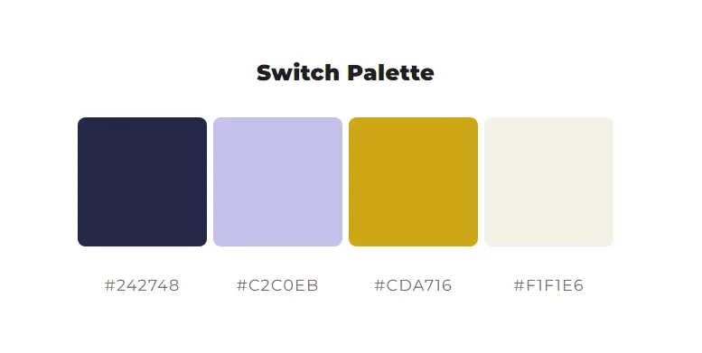
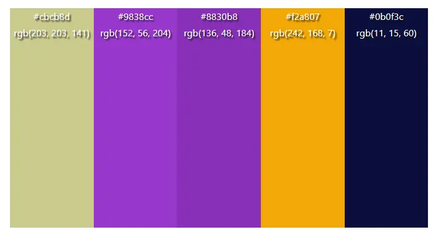
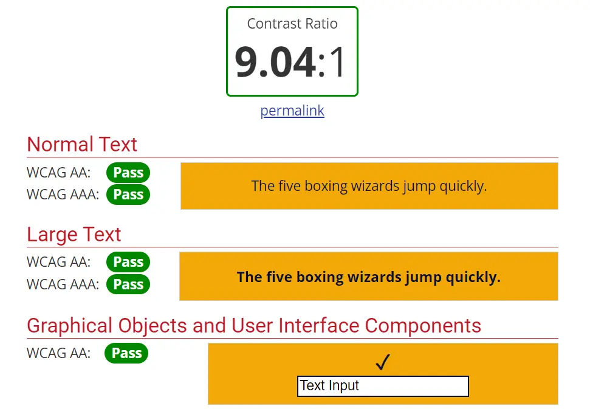
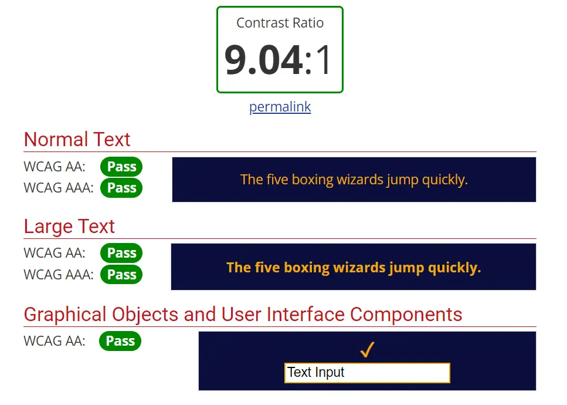
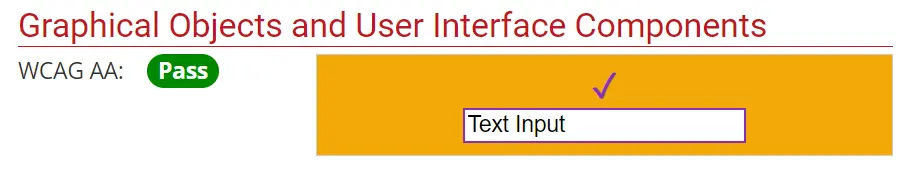
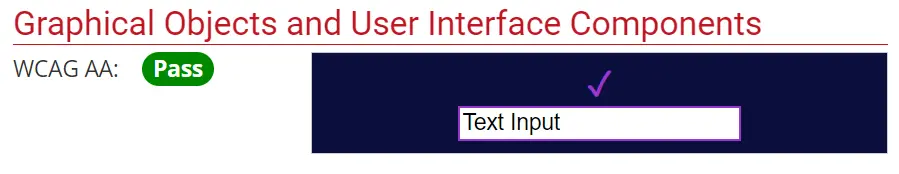
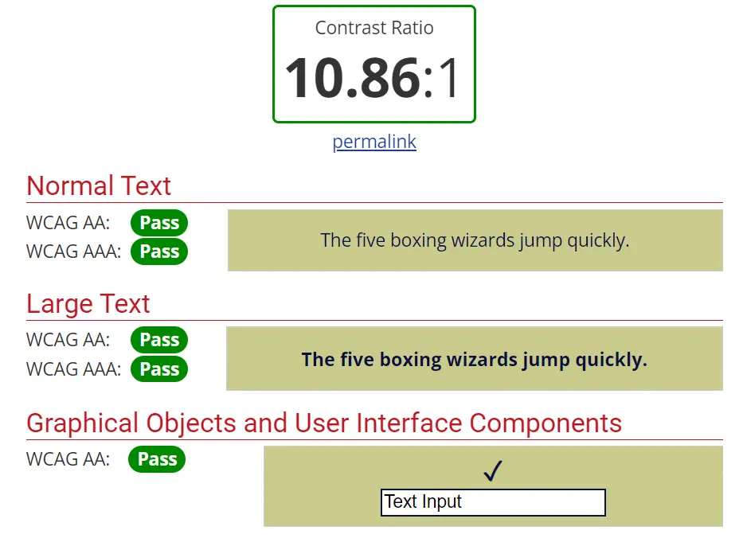
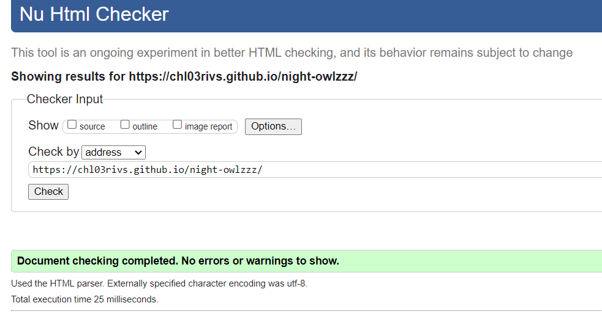
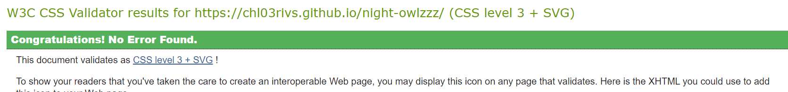

check https://github.com/amylour/scoops_pp1?tab=readme-ov-file#user-experience-ux 's readme for links again

# Night Owlzzz

[View live project here on GitHub Pages](https://chl03rivs.github.io/night-owlzzz/index.html)

Night Owlzzz is a late-night café-bar in Cork for those looking to escape the drink culture of the city without giving up on having a fun night out. Visitors can play board games, read, or simply hang out until the late hours while sipping on hot drinks, mocktails or eating healthy snacks and sandwiches. 

The website will be targeted to new and returning customers alike. Night Owlzz will be useful for customers looking to book a table/room in advance and prepare for their visit (by browsing the list of games, food, etc.).

----
## User Experience
----

Night Owlzzz is a cosy café-bar with loads to offer. It required a unique but straight-forward design that could host enough information for the new and returning visitors alike.

### User stories
*First time visitor*

* A first time visitors can immediately understand what the business is about from the homepage
* The user is invited to walk into the shop or book a slot for their group ahead of time
* The location and opening hours of the business are easily accessible at the footer with very little scrolling on the homepage (and recurring on every page)
* The user can easily navigate to the game list or menu using the navigation bar to prepare themselves for their visit

*Returning/frequent visitors*

* Returning users can quickly scroll to the footer to check the opening-hours of the business
* They can navigate to the menu and games pages to prepare for their visit

----
## Design
----
### Color palette

The initial colour palette was generated with xx was aiming for a night theme with golden and purple accents.

In order to ensure that our website is accessible, we had to rethink this palette a little, with the help of [WebAIM contrast checker](https://webaim.org/resources/contrastchecker/).

The current palette conserves this dark blue and gold theme, reminiscent of a starry night sky, with the addition of a soft purple and pistachio green.

You can click on the colors below to expand the section and see the result of ratio for these colors:

 Dark blue: #0B0F3C  

Gold: #F2A807  

Soft purples: #8830b8 (on gold) and #9838CC (on dark blue)  

Since this colour is only used for active list markers and the footer icons, it only needed to pass the "Graphical Objects and User Interface Components" category.

Pistachio: #CBCB8D  

### Typography

The entire website uses the same font: [Kode Mono](https://fonts.google.com/specimen/Kode+Mono) from Google Fonts.

It's a monospace font which contributes to the "retro" and "gaming" themes of the business.

------
### Future features
----

* *Blog section* - to provide users with game tutorials and reviews for an enhanced in-person experience. 
    * I believe that this would be a helpful feature to have on the website as it would help visitors decide what game they would like to play before their visit. 
    * It would also make it easier for party members that are new to board games to learn ahead of time and enjoy their visit more.
* *Form confirmation page* or *pop-up* - to provide users with a confirmation message post form submission.
* *A sticky header* - for better navigation

----
## Technologies used
-----

* HTML
* CSS

### Frameworks, libraries, technologies and programs used

* [Canva](https://canva.com) - to create logo and favicon
* GitHub - used to save and store all of the website's files
* Git - used for version control
* Google Fonts - to import website font
* [Font Awesome](fontawesome.com/) - icons and their associated kit were downloaded from here
* [My Color Space](https://mycolor.space) - for the initial color palette
* [WebAIM contrast checker](https://webaim.org/resources/contrastchecker/) - to create a more accessible color palette
* [Favicon.io](https://favicon.io) - to generate favicon files
* Google Dev Tools - to debug and test responsiveness
* The [official W3C validator](https://validator.w3.org/nu) - to test HTML
* The [official (Jigsaw) validator](https://jigsaw.w3.org/css-validator/) - to test CSS

-----
## Deployment
----
Github Pages was used to deploy this live website. The steps taken were as follows:

1. Log in (or sign up) to [Github](https://github.com).
2. Find the repository for this project from [my profile](https://github.com/chl03rivs) in [night-owlzzz](https://github.com/chl03rivs).
3. Click on the *Settings* link.
4. Click on the *Pages* link in the left hand side navigation bar.
5. In the *Source* section, choose *main* from the drop down select branch menu. 
6. Select *Root* from the drop down select folder menu.
7. Click *Save*. 
8. Your live Github Pages site is now deployed at the URL shown.

----
## Testing
----

Testing was performed throughout development using multiple devices along with the Chrome Dev Tools. I made sure to deploy the website early so I could test it on a range of devices and have a real-life impression of it.

### HTML validation

No errors were returned when passing through the [official W3C validator](https://validator.w3.org/nu):

### CSS validation

No errors were found when passing through the [official (Jigsaw) validator](https://jigsaw.w3.org/css-validator/):

Upon using the tool for validating my CSS, it did mention a few warnings regarding:

* The use of "-webkit" elements/pseudo-elements as they are vendor elements. 
* Likewise with the use of CSS variables to include the Font Awesome icon as a font for markers.

These do not invalidate the website's CSS.

### Bugs and fixes

One of the issues I encountered during development was the display on mobile devices and smaller laptops. I noticed that a horizontal scroll was enabled on most of the pages.

After investigating, I was able to fix the problem:

* I was using 100vw (viewport-width) as the width of most elements
* I changed it to 100% and it fixed the issue

This is because the unit vw takes into consideration the whole viewport width, without excluding the width of the vertical scroll bar.

Using a percentage value uses the whole visible screen instead and therefore removes the horizontal scroll.

---
## Credits
----
### Content references

* All content written for the website is purely fictional, and for educational purposes only.
* [Code Institute](https://codeinstitute.net) for their amazing modules on HTML and CSS.
* [W3Schools](https://www.w3schools.com/) for additional learning materials and tutorials, specifically:
    * [Button animation](https://www.w3schools.com/css/css3_buttons.asp#:~:text=Try%20it%20Yourself%20%C2%BB-,Animated%20Buttons,-Example);
    * [Box shadow doc](https://www.w3schools.com/cssref/css3_pr_box-shadow.php) which, along with [this Stackoverflow thread](https://stackoverflow.com/questions/24709915/blur-the-edges-of-an-image-or-background-image-with-css) helped me create a blurred block overlapping with the top of my hero images so they blend into the background.
* [Font Awesome's documentation](https://origin.fontawesome.com/docs/web/add-icons/pseudo-elements#font-families-and-styles-cheat-sheet), which helped me use their moon icon as a list marker to replace bullet points.
* [Kera Cudmore - Creating your First README](https://github.com/kera-cudmore/readme-examples) for README structure and Markdown guidance.

### Media References

* [Unsplash](https://unsplash.com) for all images used on this site.
* [Font Awesome](https://fontawesome.com/) for all the icons used on this site.
* [Canva](https://canva.com/) for the design of the NightOwlzzz logo and favicon.
* Favicon.io to generate the favicons of this project.
* Google Maps for the embedded map used.

### Acknowledgements

* I would like to acknowledge my Code Institute mentor, Oluwafemi Medale, for his guidance and encouragement on this project.
* My family and friends for testing my work and providing me with so many point of views and thoughts on the website throughout its development.